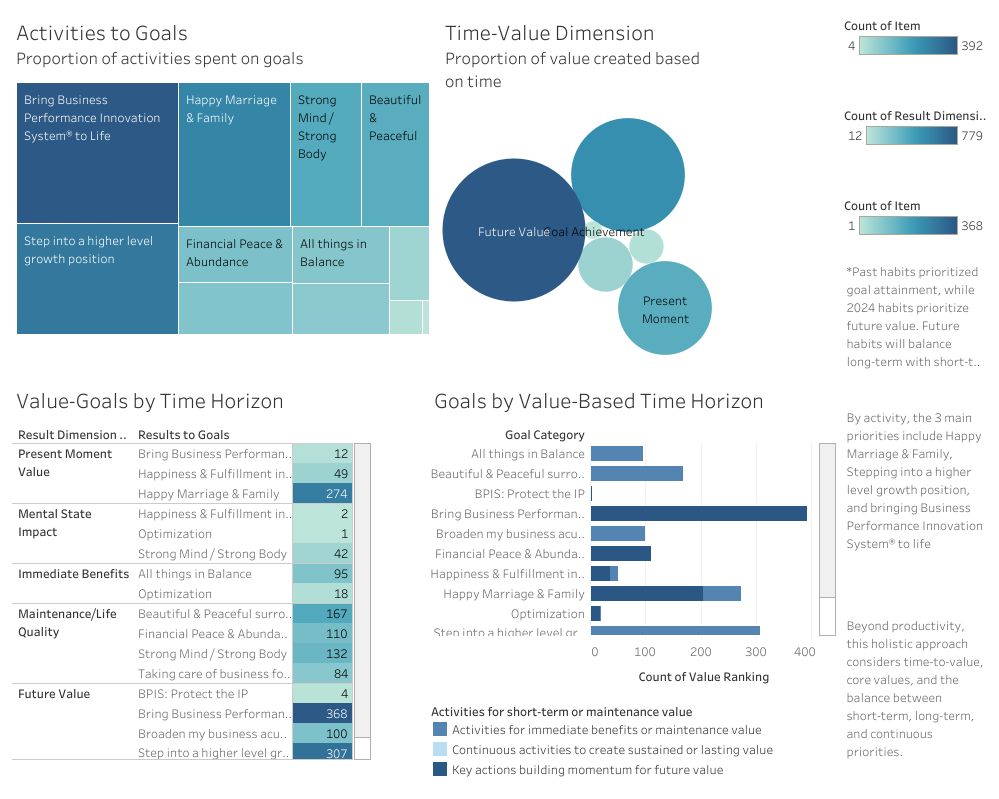
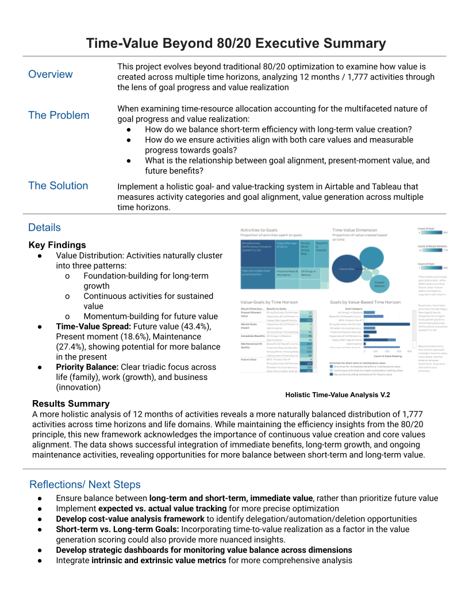
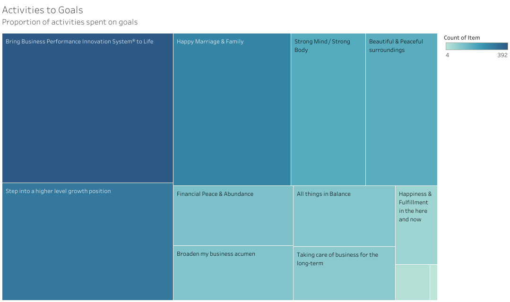
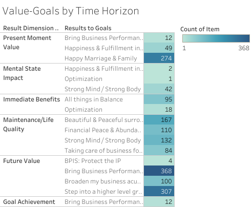
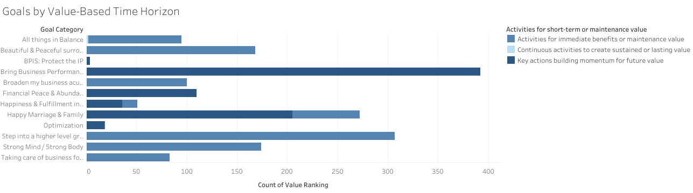

# Time-Value Optimization: Beyond 80/20

**A Holistic Approach to Aligning Activities with Personal Values and Goals**  
Analysis of 12 months of activity data (February 2024 - February 2025) to examine goal progress and value generation across present, short-term, and long-term time horizons.

### [Live Dashboard](https://public.tableau.com/views/Time-OptimizationV_2Beyond8020Analysis/Dashboard1?:language=en-US&:sid=&:redirect=auth&:display_count=n&:origin=viz_share_link)

---

## Executive Summary & Key Findings

---

### Strategic Insights: 💡

This analysis revealed a holistic approach to time-value optimization, considering time-to-value, core values, and the balance between short-term, long-term, and continuous priorities. This framework broadens the definition of value to include intrinsic value (e.g., happiness, fulfillment) alongside extrinsic outcomes, ensuring a more balanced and meaningful allocation of time and resources.

1. **Activity Results - Goals Alignment** 🎯
   - The primary purpose of this tool is to **align daily activities with personal goals and values**, answering the question: *Why am I doing what I'm doing?*
   - Activities are **categorized by their contribution to short-term, mid-term, long-term, or continuous goals**.
   - **Continuous goals**, such as maintaining a happy marriage or fostering personal well-being, **require consistent effort without a specific endpoint or measurable payoff.**

2. **Time-Value Alignment** ⏲️
   - **Multi-Dimensional Value Creation:** Analysis reveals a balanced distribution across time horizons, from present moment to future value generation.
   - **Evolution of Focus:** Shifted from goal-achievement-centric (past) to future-value-prioritization (2024), with 2025 targeting equilibrium between long-term and short-term value.
   - **Life-Work-Business Balance**: Clear alignment across three major priorities: family life (Happy Marriage & Family), professional growth (higher level position), and business innovation (BPIS).
   - **Value Generation Patterns:** Activities naturally cluster into three key dimensions:
 	   * Foundation-building steps for long-term growth
 	   * Continuous activities maintaining sustained value
 	   * Momentum-building activities for future value

3. **Core Values Alignment** 📐
   - Engaging in activities that reinforce core values is valuable in itself, regardless of measurable outcomes.
      - 32% alignment with primary values like Impact & Innovation
      - 28% alignment with secondary values such as Family Bonds & Connection
   - The relationship between core values alignment and value generation is examined both within and outside the pursuit of specific goals.

4. **Resource Allocation Patterns** 📊
   - **Pareto Distribution**: While 23% of activities are responsible for generating the majority of extrinsic value, this analysis acknowledges the role of luck and external inputs.
   - **Opportunity Costs**: Due to the role of luck and the requirement of inputs from others, the analysis revealed the need to reorient activities where there is more control or autonomy over results.
   - **Continuous Inputs**: Some goals and values require ongoing effort without a clear endpoint, emphasizing the importance of maintenance and consistency.

### Impact Analysis
- **V.1 Focus**: The initial version emphasized the 80/20 principle, identifying that 23% of activities generated 80% of extrinsic value.
- **V.2 Evolution**: This version expands the definition of value to include intrinsic measures (e.g., happiness, fulfillment) and examines value across present, short-term, and long-term horizons.
- **V.3 Direction**: Future iterations will incorporate detailed cost-value analysis, tracking expected vs. actual results for both value generation and associated costs. This will enable more precise 80/20 optimization and identify activities prime for delegation, automation, or elimination.
- **Holistic Approach**: The framework evolves beyond simple productivity metrics to examine the continuous nature of goals and value, while also considering the true costs and tolerances of maintaining various activities.

---

## Advanced Insights & Lessons Learned 🔬
### Value Focus Evolution

#### Historical Perspective
- **Past Focus**: Goal achievement as primary driver
- **2024 Approach**: Future value prioritization
- **2025 Direction**: Balanced integration of long-term and short-term value

#### Value Distribution Analysis 
- Balanced life indicators shown through even distribution across time dimensions
- Multi-faceted value creation spanning present state, immediate benefits, and future outcomes
- Tri-dimensional priority balance across life (family), work (growth), and business (innovation)

### Value Generation Framework

#### Time-to-Value Matrix
- **Immediate Value**: Short-term gains and quick wins
- **Building Value**: Mid-term achievements that compound over time
- **Foundation Value**: Long-term investments in future capabilities
- **Continuous Value**: Ongoing activities that maintain momentum and well-being
- **Intrinsic Value**: Happiness, fulfillment, and satisfaction in the here and now

### Goal Categorization Insights 📑

#### Goal Time Horizons
- Short-term (0-3 months)
- Mid-term (3-12 months)
- Long-term (1+ years)
- Continuous/Ongoing (no fixed endpoint)

#### Value Realization Patterns 
- Direct value generation (measurable outcomes)
- Indirect value creation (enabling factors)
- Compound value effects (synergistic benefits)
- Maintenance value (preventing decline)
- Intrinsic value (happiness, fulfillment, and satisfaction in the here and now)

## Key Discoveries 🔦

### Beyond Simple 80/20
The traditional Pareto Principle provides a useful framework but requires nuanced application:
- Not all high-impact activities show immediate results
- Some seemingly low-value activities are crucial for long-term success
- Value generation often follows non-linear patterns
- Some activities provide intrinsic value (e.g., happiness, fulfillment) as the payoff itself

### Activity-Goal Alignment
The primary purpose of goal tracking is to align activities to results and goals, answering the question: *Why do I do what I do?* Understanding this relationship requires:
- Clear categorization of goal types
- Recognition of multiple value-generation timeframes
- Balanced focus between immediate and future outcomes
- Acknowledgment that not all activities need to be optimized for long-term results
- Staying present and valuing time spent on activities that provide intrinsic value, such as happiness, fulfillment, or connection

### Optimization Strategies ➕

#### Value Assessment
- Consider both immediate and potential future value
- Account for enabling and maintenance activities
- Recognize compound effects of consistent actions
- Acknowledge intrinsic value (e.g., happiness, fulfillment) as a valid outcome

#### Resource Allocation
- Balance short-term wins with long-term investments
- Maintain crucial ongoing activities
- Allocate time based on goal horizon and value type
- Prioritize activities that align with core values

#### Progress Tracking
- Measure both activity completion and value generation
- Track progress across different time horizons
- Monitor alignment between activities and goals
- Include qualitative metrics for intrinsic value (e.g., satisfaction, fulfillment)

---

## Implementation Framework 📋

### Goal-Activity Alignment Framework
- Each activity is explicitly linked to a specific goal or core value
- Goals are categorized by time dimension (Short/Mid/Long/Continuous)
- Activities inherit meaning and context from their linked goals or values
- Multiple activities can contribute to the same goal
- Value generation is assessed in the context of goal progression or core values alignment

### Activity Classification System
- Goal Category (Life/Work/Business)
- Time Horizon (Short/Mid/Long/Continuous)
- Value Type (Immediate/Building/Foundation/Continuous/Intrinsic)
- Core Values Alignment
- Expected Outcomes (measurable or intrinsic)

### Goal Progress Framework 
- Track activities' contribution to specific goals or core values
- Monitor progress across different goal time horizons
- Assess both activity completion and goal advancement
- Balance resource allocation across goal categories
- Regular review of goal-activity alignment

---

## Methodology 📑

### Data Collection Framework
- Duration: 12 months (February 2024 - January 2025)
- Activities Tracked: 1370 total
- Classification System:
  - Activity Categories
  - Core Values Alignment
  - Maslow's Hierarchy Integration
  - Value Generation Metrics (measurable and intrinsic)

### Airtable Time-Value Tracking

---

## Tableau Visualization Methods 🖼️

**1. Activities to Goals**
Visualization Type: Tree Map
This visualization shows the proportion of activities spent on goals, using size and color to represent volume. Major blocks include Business goals (BPIS implementation), Life goals (Happy Marriage & Family), and Development goals (Growth position). Each block's size represents the relative number of activities dedicated to that goal, providing an immediate visual understanding of time allocation across major life areas.

**2. Time-Value Dimension**
Visualization Type: Bubble Chart
This visualization displays the proportion of value created based on time horizons including Future Value (largest proportion), Present Moment Value, Maintenance/Life Quality, Immediate Benefits, and Mental State Impact. The size of each bubble represents the volume of activities in each time dimension, showing the balance between future-oriented and present-focused activities.

**3. Value-Goals by Time Horizon**
Visualization Type: Matrix/Cross-Tab
This detailed breakdown shows the intersection of time dimensions (Present Moment, Mental State, Immediate Benefits, etc.) and specific goals (e.g., BPIS, Happy Marriage & Family). Quantities are shown numerically, allowing precise analysis of how different goals manifest across time horizons.

**4. Goals by Value-Based Time Horizon**
Visualization Type: Horizontal Bar Chart with Color Coding
Shows goals categorized by their value-generation timeframe with activities for short-term or maintenance value, activities for immediate benefits or maintenance value, continuous activities for sustained value, and key actions building momentum for future value. Color coding helps distinguish between different value-generation types.

**5. Metrics & Context Notes**
Visualization Type: Text Annotations
Key metrics and contextual information including activity counts, time dimension distributions, historical context ("Past habits prioritized goal attainment, while 2024 habits prioritize future value..."), and strategic insights about balance between short-term and long-term priorities. This dashboard provides multiple perspectives on the same data, allowing users to understand both the high-level patterns and detailed breakdowns of how activities align with goals across different time horizons.

---

## Tools & Technology 🛠️

### Current Stack
- Airtable for activity and goal tracking
- Tableau for visualization and analysis
- Custom formulas for value calculation
- Integration with productivity tools

### Future Enhancements 
- Enhanced automation of data collection
- Advanced calculations in Airtable, including expected vs. actual results
- Consideration of intrinsic and extrinsic costs and value generated
- Improved visualization of goal progress
- Better integration of qualitative factors (e.g., intrinsic value)

---

## Conclusion 🌌

This iteration of the Time-Value Optimization Project emphasizes a more holistic approach to time management, broadening the definition of value to include intrinsic measures such as happiness and fulfillment. By examining value across present, short-term, and long-term horizons, this framework ensures a more balanced and meaningful allocation of time and resources. It acknowledges that not all time needs to be optimized for productivity or rewards, and some activities provide intrinsic value simply by being present and aligned with personal values. Continuous goals and values are prioritized, reinforcing the importance of consistency and maintenance alongside growth and achievement.

---

## Contact 📧
- [Tableau Portfolio](https://public.tableau.com/app/profile/melissa.slawsky1925/vizzes)
- [Client Results](https://melissaslawsky.com/client-results/)
- [Email](mailto:melissa@melissaslawsky.com)

---
© Melissa Slawsky 2025. All Rights Reserved.

---
